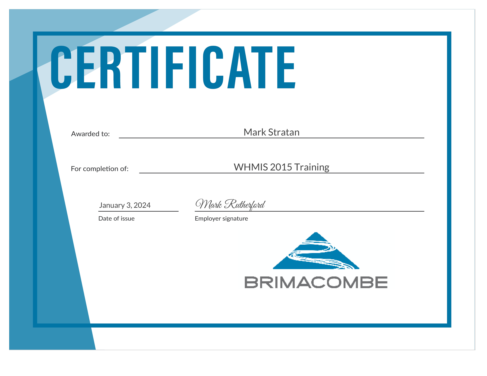
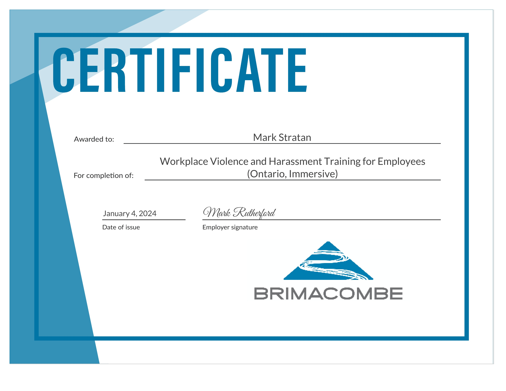
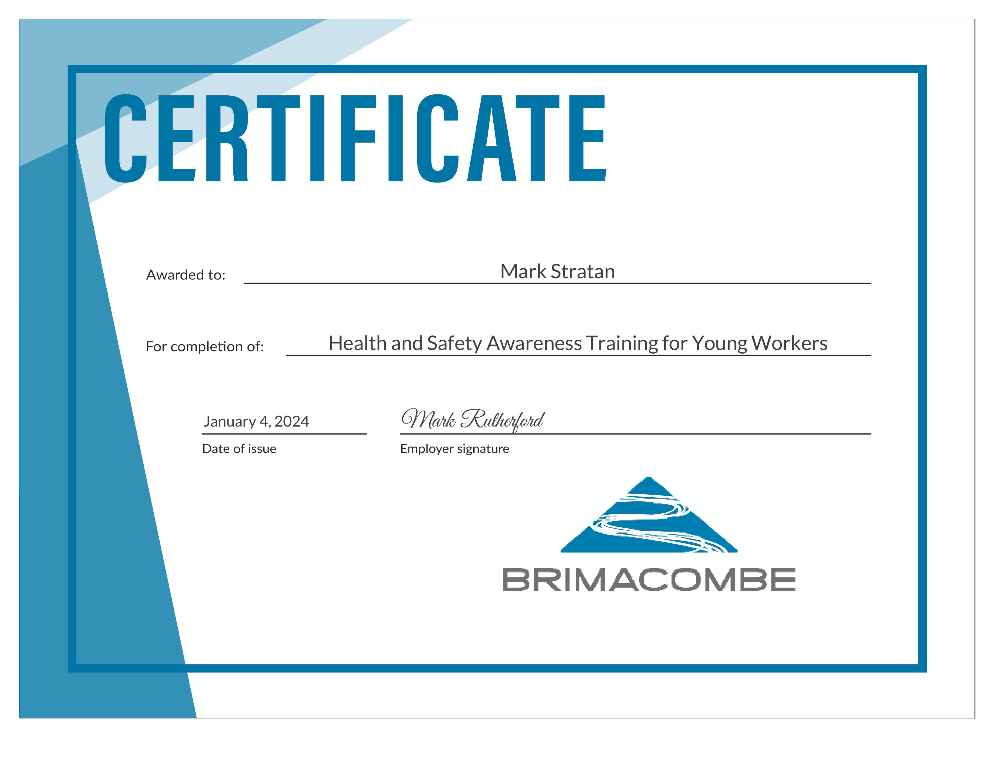
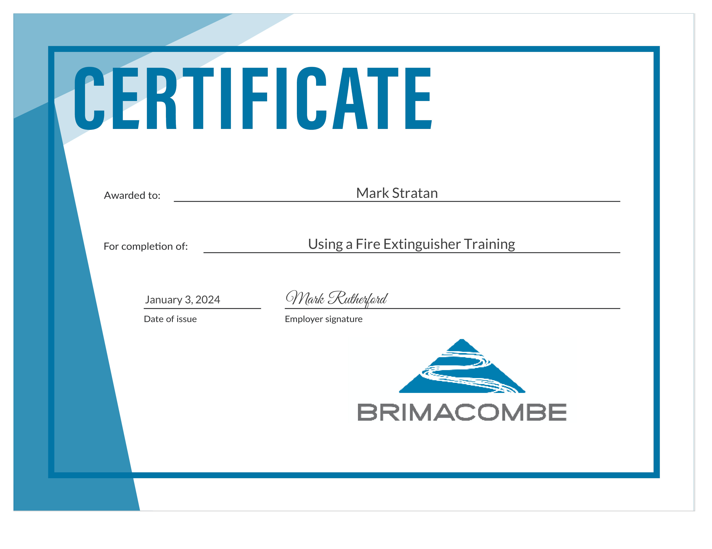
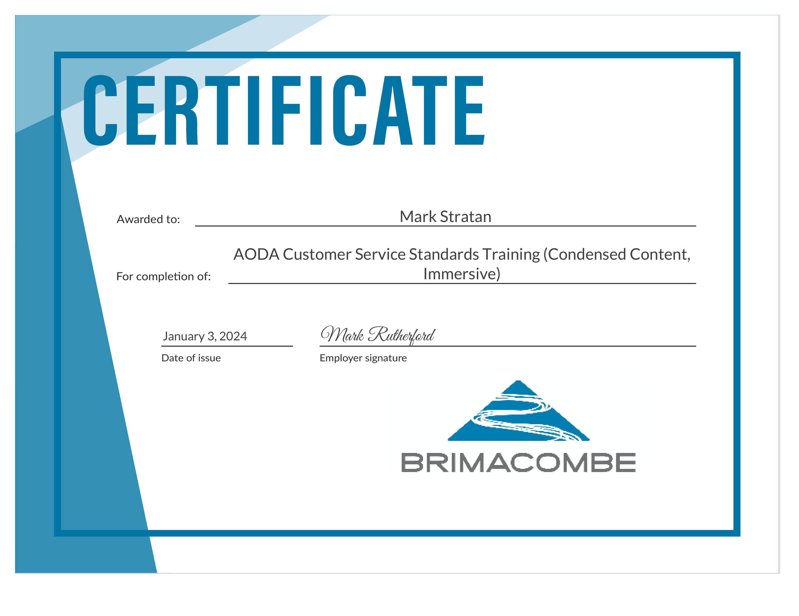
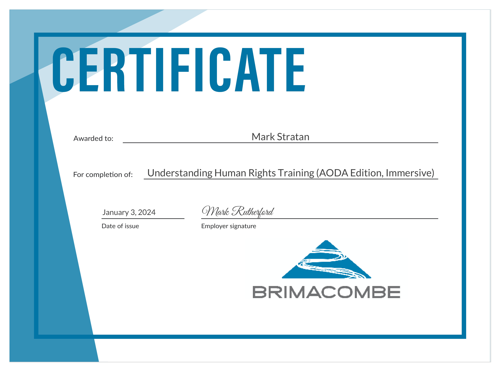
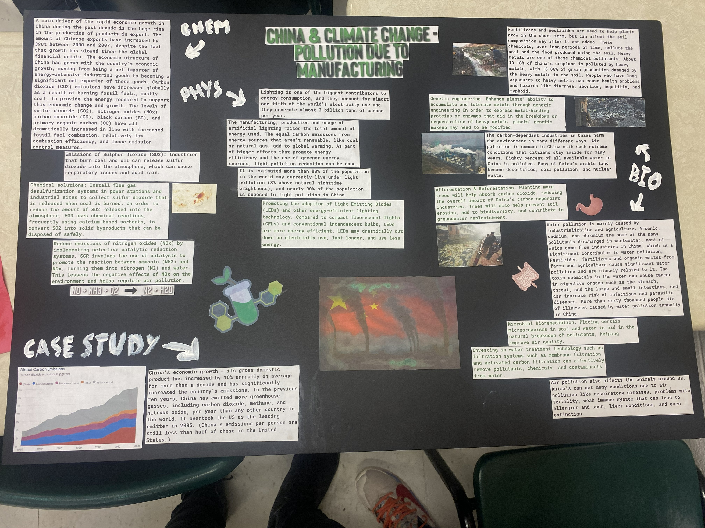

# Grade 10
# Section 1: Personal Information
## Career Investigation
Using the MyBlueprint website as well as the available surveys on the website, it was able to help me find a career that had the best compatibility with myself. The personal surveys were used to help find out if the occupation I choose would be a match. The occupation surveys helped find out the percentage match score of the surveyed occupation.   

After completing the personal and Occupation surveys for five occupations that interested me the most, I found out that: the highest match was 75%  Electronics Engineer with Biological Technician, 2nd with 66%, and Chemical Engineer, 3rd with 63%. These occupations also had good matches with my personal survey results. 

After finding out my best matches, I realized that these 3 occupations, though having the best matches, also had a connection to what I liked to do such as, with the electronics engineer occupation, having a deep understanding of computers with more specific understandings of computer science and computer programming. These three occupations are what I think will be the occupations I will be pursuing in the future.

## Resume
[Download .docx](../assets/Resume-P1.docx)
## Cover Letter
[Download .docx](../assets/CoverLetter-P2.docx)
## Evidence of Academic Achivements

# Section 2: SciTech Skills & Knowledge & Certifications
## SNC2DR Science
### Symposium Project
The Science project that I chose to show is the Science Culminating: China and Climate Change - Pollution due to manufacturing. To begin the Science Culminating we were first put into groups by the teacher, and as a group had to choose a topic about the environment; we chose China and Climate Change - Pollution due to manufacturing. After choosing the topic we had to gather information about the effects on biology, physics, and chemistry on the surrounding land, how it works and how it affects people. After that we had to present it to the class as a group while other groups also presented.
### Reflection
In this final Assignment I learned a lot about how climate change isn’t just affecting the climate of the Earth but also the people that live on Earth. At the beginning of the project we chose the topic of China and Climate Change, and over the next few days we gathered information on the effects of pollution (Climate Change) by manufacturing in China in the topics of Biology, Chemistry and Physics. Lastly we got a board, and printed all the information neatly and added it to the board with statistics and images that were related to our topic. This project was interesting since I found out about many more effects of climate change.

## TDJ2OR Technological Design
### Pen/Pencil Holder Project
In this project we first had to design a unique pen/pencil holder on paper. Then make a digital design on TinkerCad, make a rough design out of cardboard, and then finally make a colorful version of it as the final clean copy.
### Reflection
I chose this Tech project about making a pen/pencil holder out of cardboard and colored paper because it was the longest and interesting build I built. This project was simple since it consisted of drawing different kinds of pen/pencil holders and choosing one, making a rough build of how it would look and then building the final copy of the pen/pencil holder. It took longer than I thought since it had a few steps, but each step took quite a while to do. When building the actual pen/pencil holder, there were gapes that I didn’t account for when cutting the pieces and gluing them together. In the end, when I finished all the steps the pencil holder looked really good which surprised me.

# Section 3: Community Work & Extracurricular Involvement
## Ski School

**Date:** January 2024 to March 2024

**Hours:** 30

**Responsibility:** Assist in teaching skiing to children
##Reflection:
Every Sunday from January to March  At 11 am and 1 pm, I would help the coach with teaching the little kids. We would slowly progress and get them ready for the big proper slopes using a less steeper and less longer slope for practice. After many weeks we would start going on larger slopes and a few harder ones as well. 

# Section 4: Extracurricular SciTech Experiences
In Coding Club for Zebra Robotics, I was able to finish the rest of the Python coding challenges, and start learning about how statements work Java and JavaFx coding since it is a different kind of coding language.

I learned about how to use the different incode built functions and statements and how to take what I learned from python and use it in Java. Though Java is a different coding language, it still shares similarities with Python such as how the if statements work.

When I finished Python and started Java coding, I knew what to do since I have gone through a few languages already and started reading on how to do simple coding in Java to how to check if a credit card number is valid. After a few couple of months, I was able to start on JavaFx which is used to make tabs that the user can interact with.

After completing the Challenges for JavaFx, I reached the final Challenges for Java and JavaFx. For the last three challenges I had to make a GUI for three different types of code with each having a set of parameters. I was able to finish the first challenge which was making a GUI for a library program that I made previously in Java. Below are pictures of the working GUI of the library program. After the first Challenge was done, I started with the second challenge which was for a burger place you make, and didn’t finish yet. 

In June 2024, Zebra Robotics held another S.T.R.I.P.E Competition, with three categories: robotics, programming and innovation. I chose programming for python because I finished the Python Course, there was no coding for Java, and it is important to make sure you don’t forget how to code in languages you finished in. In this competition, we were given multiple challenges that were ordered from easy to hard, each giving a different amount of points. We were allowed to choose any one and allowed to do multiple of them. After the competition finished and the judges finished assessing everyone, the awards were handed out and I got 3rd place.
