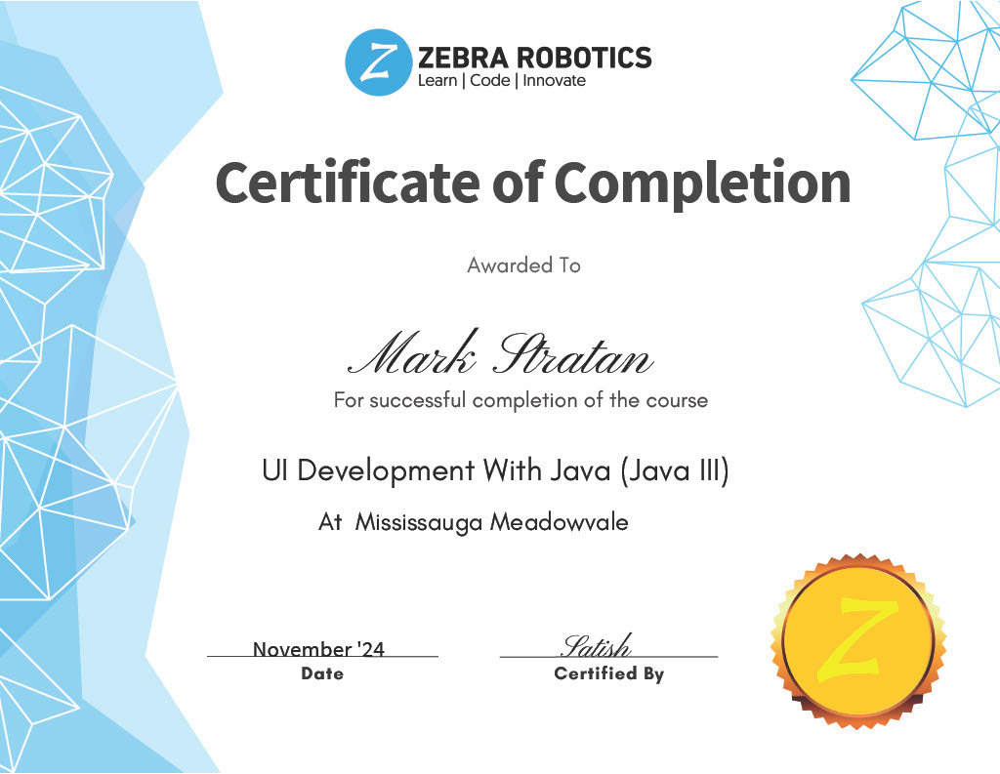

# Grade 11
# Section 1: Personal Information
## Post-Secondary and Career Plan
During my Summer break I had time to realize and understand what I would like to do as well as enjoy doing. I realized that I would like to major in Computer Science. I then used the myBlueprint and found Universities that had Computer Science programs and using that I planned what subjects I would need to take in Grade 11 and Grade 12. I saw that some universities had the same course requirements and applied for those.

Then I started looking into what universities I would like to go to for post-secondary. I shortened it down to 6 universities: University of Toronto, University of Toronto Mississauga, Toronto Metropolitan University, OntarioTech University, University of Guelph, and McMaster University. These would be the ones I would apply to and visit later.

## Evidence of Academic Achievements

# Section 2: SciTech Skills & Knowledge & Certifications
## SPH3UR Physics
### Physics Lab - Coefficient of Friction
The Science Lab I chose to show is the Physics Lab for calculating the coefficient of friction of different masses of wood. To begin we were put into groups of three to four people, and as a group we had to, through 3 trials, find the Normal Force and Average Static and Kinetic Friction, for the original mass and original + extra mass. Using the information gathered we would then calculate the coefficient of kinetic and static friction.
### Reflection
In this lab, I was able to get hands-on experience with calculating coefficients of kinetic and static friction. This hands-on experience allowed me to gain a greater understanding in a more fun and interesting environment, rather than being given the information and asked to calculate. I also realized that gaining good and reliable information to use for calculations was hard and in the conditions we were provided with, led me to see that many real life scenarios rely on trial and error for more accurate measurements and calculations.

[Download .docx](../assets/PhysicsFrictionLab.docx)

## ICS3UR Introduction to Computer Science
### Game Creation Final Project
This Technology Project is the Final Project for the Computer Science course. For this project we had created a game using Java Processing. This Project was split into three stages: Planning and Designing, Rough Implementation, and Final touches. This Project was also worked on over the course of 5 days, with each day needing to be documented on a site, google sites, and published everyday having records of how much we completed as well as images of our progress.
### Reflection
In this Final Project I learned a lot about creating and optimizing games, as well as how important is the Planning and Design stage for any large project and how it will affect the end result. During the beginning of this project we first had to decide on the game we wanted to create, make a pseudocode game, and make a simple Mock GUI Design. From there we created the code to do all the necessary tasks. Close to the end of the project we had to make the game more appealing, such as including images or using different colors to make the game stand out. Throughout this process, I was able to learn that the planning stage allowed me to slove the necessary sections faster due to already knowing what I needed to do. This project was fun and interesting sice we were able to make a game but also make it effectively.

[Visit Final Project Journal Entries](https://sites.google.com/pdsb.net/marks-journal-entries/home)

# Section 3: 
## Ski School

**Date:** January 2025 to March 2025

**Hours:** 30

**Responsibility:** Assist in teaching skiing to children
### Reflection:
Every Sunday from January to March at 11 am and 1 pm, I would help the coach with teaching the little kids. Using the experience I have gained from my past two years of volunteering, I implemented the use of simple explanations and terms as well as breaking larger steps into smaller and more manageable pieces for them. I would also help with slowly progressing through the slopes, building up the skills and confidence to go down steeper slopes.  This experience I have gained this year and the past years with be used to teach as a proper instructor next year.

# Section 4: 
After a few couple of months, or a transition from fundamentals to more object oriented java programming, I was able to start on JavaFx which is used to make User Interfaces to complete a multitude of tasks.

After completing the Challenges for JavaFx that taught me how to use it, I reached the final Challenges for Java and JavaFx. For these last three challenges I had to make a GUI for three different types of code with each having a set of parameters. I was able to finish the first challenge which was making a GUI for a library program that I made previously in Java. Below are pictures of the working GUI of the library program. After the first Challenge was done, I started with the second challenge which was for a burger place you make, and didn’t finish yet. 

In June 2025, Zebra Robotics held another S.T.R.I.P.E Competition for which we were paired into partners and had to use any Python programming experience to make an interactive map of Animal Migration patterns. To complete this challenge, my partner and I used Pygame to show three different types of animal migration patterns and used buttons to allow for more interactive ways to show each migration pattern. Though we did not receive any certificates for places, we did receive a participation award.
