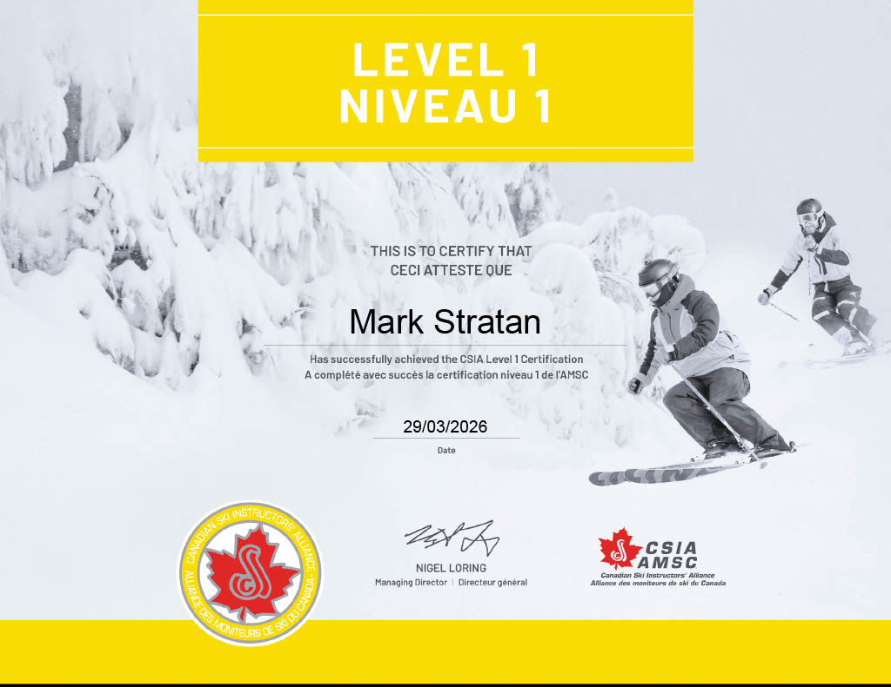

# Section 1: Personal Information
## Updated Resume & Cover Letter
[Download Updated Resume](../assets/MarkStratan-Resume-April2026.docx)

[Download Updated Cover Letter](../assets/Updated-Cover-Letter.docx)

## Evidence of Academic Achievements

# Section 2:
## SPH4UR Physics
### Marble Slingshot Project
In this culminating project, we as a group had to design, build, and tweak a marble launcher using materials that are sustainable, have little to no impact on the environment. The built marble launcher will be used to hit 3 targets from a distance of 3.5 meters away. Then, using physics concepts, we are to analyze the different parts of the marble launch, firing and collision with the target, and demonstrate a strong understanding of springs, Hooke's Law, energy conservation, kinematics, momentum, and collisions.
### Reflection
This culminating project was a very good experience since it helped me see how physics works outside of calculations on paper. This can be seen when we did many trials to find the average velocity of the marble. It was difficult and frustrating due to small changes in the rubber bands stretch that would change the calculation. With this information, and other calculations of finding the correct formula, we would then be able to calculate the distance the rubber band had to be stretched to cover a certain distance. 

[Download Project Report](../assets/Marble-Slingshot.docx)

## TDJ2OR Technological Design
### Login Page Assignment
In this assignment we needed to create a login page using Card Layout. We had to make a program where the user had to put a username and password to then move onto the next page which would say the login was successful.  
### Reflection
In this assignment we used concepts we learned earlier in this unit to complete this task such as using and implementing textfields, panels, frames, and buttons. Using all of this we were able to create the login screen. After the original program idea was finished, I tweaked the program to use passwordfield instead of textfield of the password input. This would provide security for the user. To allow the user to see what they wrote, I added a button to allow the user to change the input between the original text and the masking dots.

# Section 3: Community Work & Extracurricular Involvement 
## Ski School
**Date:** January 2026 to March 2026

**Hours:** ~50

**Responsibility:** Teaching skiing to children

### Reflection:
Every Saturday working at the ski school was a challenge but a lot of fun as well. Teaching young kids is a slow process since using technical terms doesn't work. During my time teaching patience was the top skill that helped me progressively teach the kids to become more confident and gain new skills. Through practice on smaller hills and slowly progressing forward my confidence as a leader grew with my teaching skills.

# Section 4: Extracurricular SciTech Experiences
After finishing Java and JavaFx at Zebra Robotics Coding Club, I transitioned to an online course that was provided by Harvard University for Introduction to Artificial Intelligence with Python, in June. Here I was able to learn more about AI and the different tasks it is able to handle.

This online course split up Introduction to Artificial Intelligence with Python into 6 sections: Search,  Knowledge, Uncertainty, Optimization, Learning, Neural Networks, and Language. Each one of these sections described and gave examples of each of their own benefits as well as drawbacks. Of the 7 different types of AI I was able to learn about Search, Knowledge, Uncertainty, and Optimization.

In Search AI, I learned that it finds all possible solutions to winning, losing or having a draw(No win or lose) and finds a solution for the certain action that was given to it. This can be shown easily through a Tic-Tac-Toe game that doesn’t have many ways to win. This AI uses search algorithms like depth-first and breadth-first search that help with finding the best possible way to win..

In Knowledge AI, I learned that this AI uses information already available to it to draw conclusions and solutions. This AI can use this provided information to then complete certain tasks that are ambiguous or have missing components. This Knowledge AI uses algorithms such as propositional and first order logic to make this possible

In Uncertainty AI, I learned that even with a limited amount of information it can do tasks provided a percentage probability that shows it is not entirely certain of a certain action taking place. This can be seen by the Mars rover and the uncertainty of the environment. This Uncertainty AI uses algorithms based on probability like conditional and joint probability.

In Optimization AI, I learned that it through algorithms such as hill climbing and backtracking search, it will choose the best possible option from a set of options to solve solutions

In Learning AI, I learned that even if it isn’t given an explicit task, but given access to information in the form of data, it can learn and understand this data to then later be able to perform a task on its own. These learning AI’s use algorithms like nearest-neighbor classification, and perceptron and reinforced learning to help with learning different sets of data.

In Neural Network AI, I learned that this AI was based on how humans learn new things, leading researchers to see whether the same idea can be applied to computers, leading to new algorithms like convolutional and recurrent neural networks.

In Language AI, I learned that it uses different kinds of natural language processes to help understand the structure of a sentence, but also how to respond to a question, using algorithms such as context-free grammar, word representation, and transformers.
