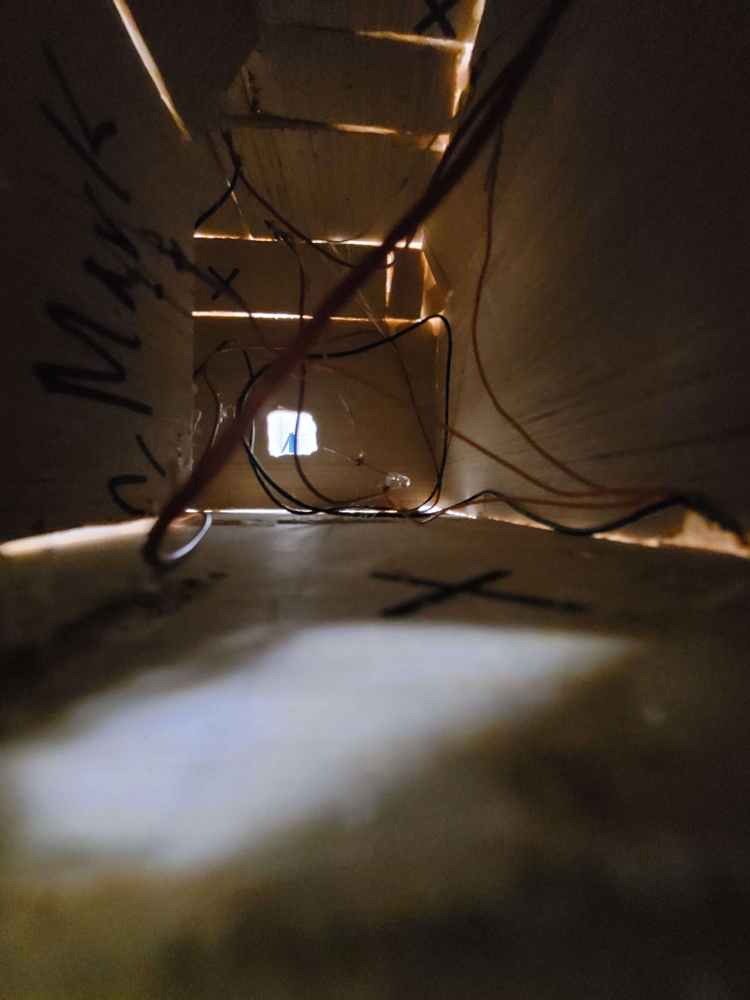
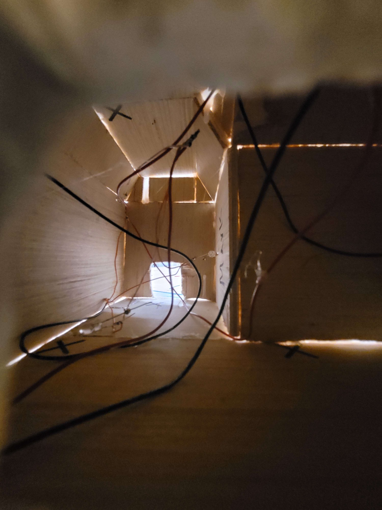
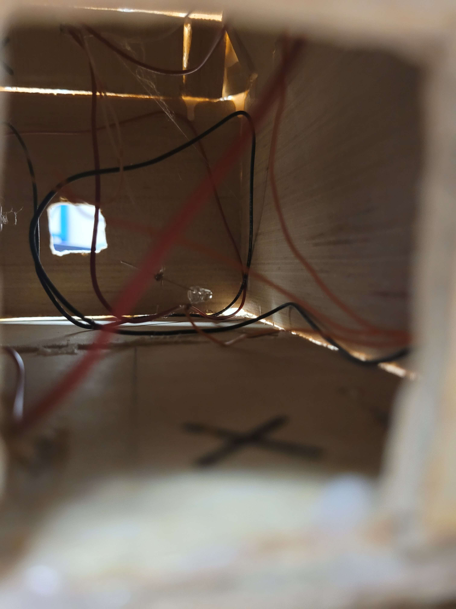

# Section 1: Personal Information
## Why I took SciTech
I took the Scitech program at Port Credit Secondary School since it would help me have a greater chance to get a spot into the universities I would like to go to in the future like University of T[..[...]

## My Future Goals
### Post Secondary
After high school I plan to enroll in Technology, Coding, or Chemistry at the University of Toronto at Mississauga or OntarioTech. I plan to either, with the help of scientists solve global issues [..[...]
I then plan to use my knowledge and experience of everything I have done to give what I have gained to the next generation so they can use it to help theirs and the next.

### Career
I dream of being an engineer for computer science, specifically cybersecurity or a frontend/backend developer.

## Evidence of Academic Achivements

# Section 2: SciTech Skills & Knowledge & Certifications
## TIJ1O Exploring Technologies
### Logic Gate Circuit Assignment
I had to build a fully-functioning logic gate circuit with the knowledge that I have learned. I had to design and build a logic gate circuit with some parameters in mind. The circuit must include [...[...]
### Reflection
In this tech project I built a Logic Gate Circuit with 5 chips and 6 inputs, and 8 LED's. I also made the schematics of the Logic Gate Circuit and the Truth Table for the Logic Gate Circuit. Whe[...]

## Renewable and Sustainable Energy Project
I had to research, design, develop, build, and test a power generation plant that uses sustainable energy such as wind or water to power LED bulbs. First, I had to research power generation and dr[...]
### Reflection
In this project my group and I had to use either wind or water to generate electricity to power up to 5 LED bulbs. In this project there were 4 stages: research, drawing, materials, and constructi[...]

  
  

## SNC1WR Science
### Periodic Table Wanted Element Poster
I had to choose and research an element from the periodic table and design a "WANTED" or "HERO" poster of that element. The poster needed to have five pictures of that element and where it[...]
### Reflection
I chose this Science project because we got to choose what element we wanted to research and make a poster about. I also learned a lot about the element Lead from this project. This project had a [...[...]

# Section 3: Community Work & Extracurricular Involvement
## SciTech Open House
**Date:** October 13, 2022

**Hours:** 5

**Responsibility:** Filling the Lab Dish with Milk, put food coloring drops, and showing the reaction when drop of dish soap comes in contact
### Reflection:
At the Open House, I went to a group that talks about chemistry.  I showed the reaction when a drop of dish soap comes in contact with milk that has food coloring, wash the dish and do it again. W[...]

## Ski School
**Date:** January 2023 to March 2023

**Hours:** 30.57

**Responsibility:** Assist in teaching skiing to children
### Reflection:
At the Brimacombe Ski School in Orono, Ontario I would help instructors teach skiing to little kids. I would go there every Sunday from January to March at 11 am to 1 pm. On the first few days we [...[...]

# Section 4: Extracurricular SciTech Experiences
In Coding Club at Zebra Robotics, I learned programming in Python, Javascript, how to make websites in HTML, and how to program EV3 Robots and tell them what to do.

I learned how to code and it was a fun learning experience. Recently I have worked on the following small projects: labyrinth game, duck shooter, and recreating the snake game. Working on these pr[...]

When I first started HTML, it was the first time I would use my first programming language. With HTML I could add text, add pictures, add videos, and use css to change color, length and width.

After HTML, I started Javascript. I knew it was like HTML but you can use complex commands to do more. In the Beginner and Intermediate stage of Javascript I was doing challenges to use the differ[...]

When I first started Python programming I wanted to learn how it works and what was the difference from Javascript. I also was surprised how different Python was from Javascript. It was difficult [...[...]

On June 18, 2023, Zebra Robotics held a STRIPE Competition. There were 3 categories: robotics, programming and innovation. I chose programming for python because it was the language I was learning[...]

