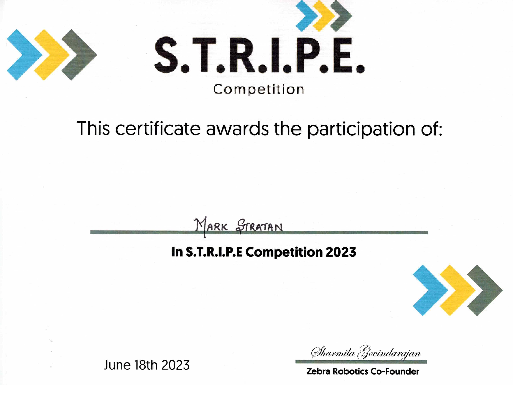
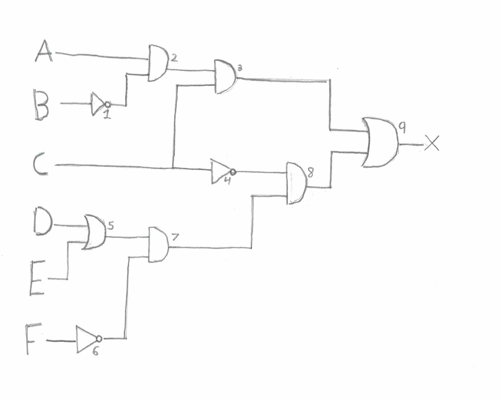
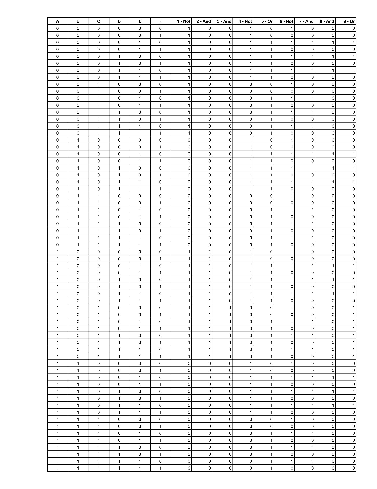
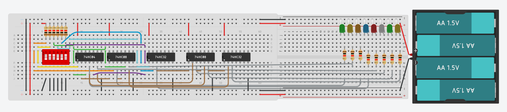
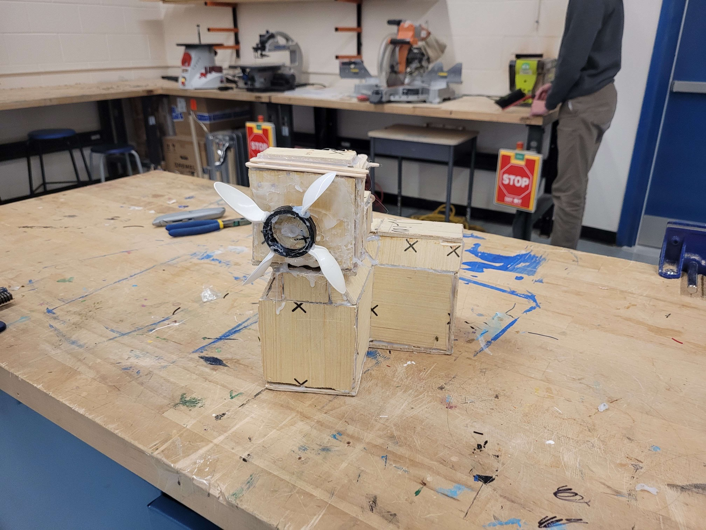
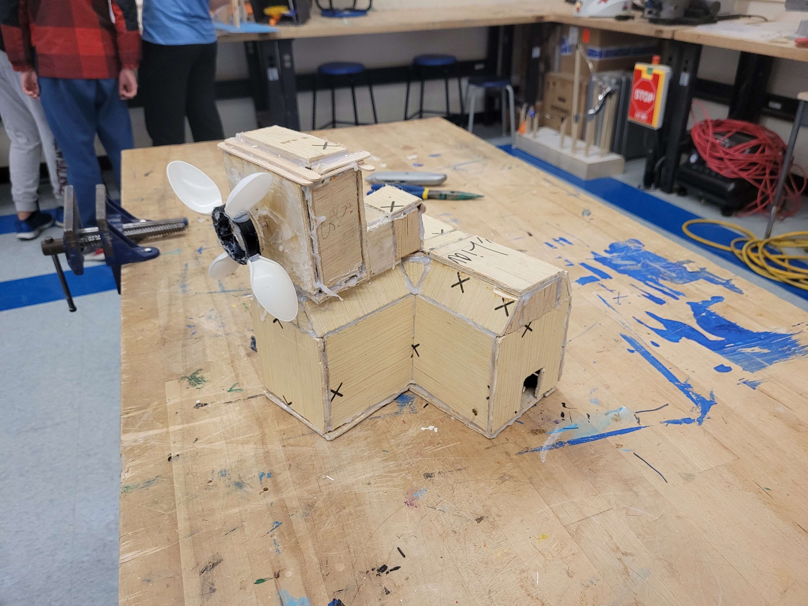
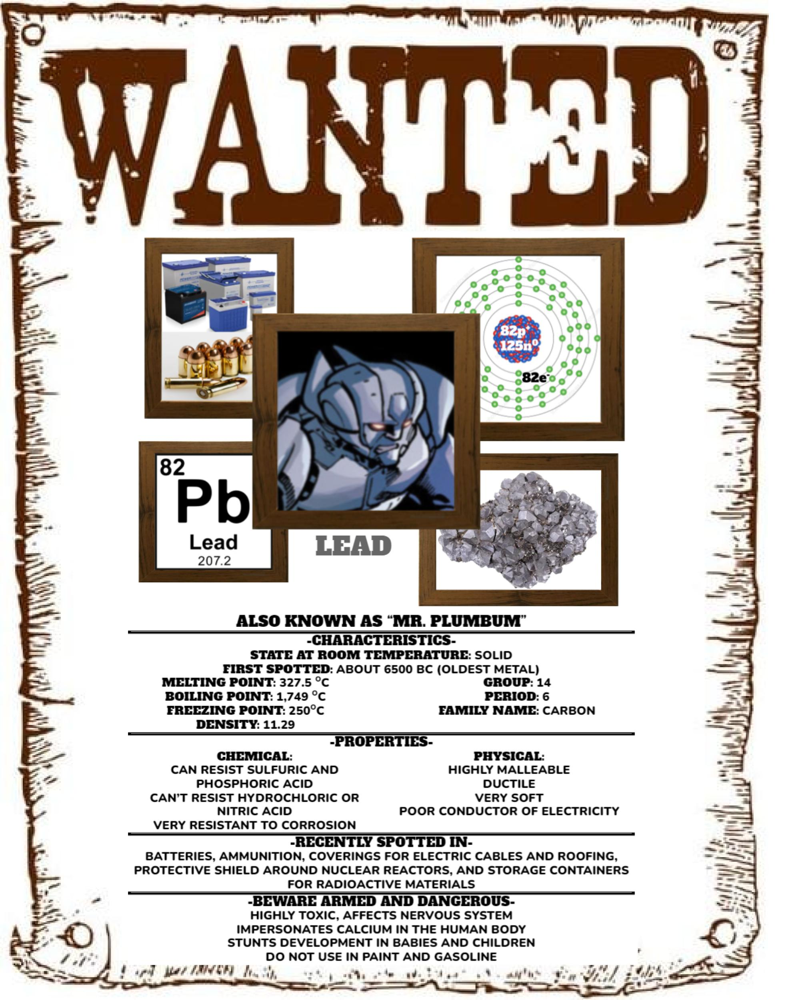

# Section 1: Personal Information
## Why I took SciTech
I decided to apply to the Scitech program at Port Credit Secondary School since it would help me have a greater chance to get a spot into the universities I would like to go to in the future like University of Toronto, or OntarioTech University. This program would help me succeed in pursuing my dreams in Engineering and Science since it would help me develop skills that would be important for the future. I have always liked figuring out how things work and learning different languages for coding and the Scitech program would provide me with more experience that would allow me to become better at these things. The Scitech program’s learning environment would help my passion as well as my experience to grow, allowing me to be more experienced in the fields that interest me. The Scitech program would also allow me to gain connections to like-minded people, allowing me to exchange experiences and ideas that would allow me and these other people to grow as well.

## My Future Goals
### Post Secondary
After high school I plan to study Computer Science, or Chemistry at the University of Toronto at Mississauga or OntarioTech. I would love to work with new technologies to solve real world issues such as feeding a growing population and providing clean energy. I also want to use digital platforms from a social science perspective and apply these concepts to work-integrated learning opportunities. In the future I plan to use my knowledge and experience and pass it onto the next generation so they can use it to help theirs and the next.

### Career
My ultimate goal is to become a software engineer. I want to work in cybersecurity or a frontend/backend developer. The technological work is changing and I want to be one of the people building ways to protect systems and personal data. The Scitech program will help me to gain the technical skills to do these fast changing jobs.

## Evidence of Academic Achivements

# Section 2: SciTech Skills & Knowledge & Certifications
## TIJ1O Exploring Technologies
### Logic Gate Circuit Assignment
For this project, I had to build a fully-functional logic gate circuit with the knowledge that I have learned, as well with certain parameters in mind. The circuit must include three different logic gate chips, and four or more different inputs, have at least two gates must be used twice, and the circuit must include necessary hardware such as a DIP switch, Logic Gate Chips, LED’s, connecting wires, etc. These components had to be installed neatly. Along with these parameters the project was split into 3 parts. I had to make (1) a diagram/schematics of the logic gate circuit, (2) a digital copy of the completed truth table, and (3) a fully functional circuit board in tinkercad.
### Reflection
In this tech project I built a Logic Gate Circuit with 5 chips and 6 inputs, and 8 LED’s. When we first got this project I was a little excited and happy, but also confused about what I had to do. But through the time I was working with Logic Gates the confusion went away and I was happy and excited. I better understood more about the technology around us, but more specifically the circuits. The most annoying part about this project was making the Truth Table because it was extremely long.

## Renewable and Sustainable Energy Project
For this project, we had to research, design, develop, and build a power generation plant that uses sustainable energy such as wind or water to power LED bulbs.  The project was split into four steps: individual sketches and research, making an orthographic model of a consumer device that would use the created electricity, group decisions on the materials needed, and finally the construction of the power generation facility and consumer. After completing the construction and finished testing, we would individually submit a report explaining what we did.
### Reflection
In this tech project my group and I had to use either wind or water to generate electricity to power up to 5 LED bulbs. This project had 4 stages: research, drawing, materials, and construction. For the first 2 stages, we had to do it individually before coming together for the next stages. For the First stage, we had to research how to generate energy using either wind or water, and answer a couple of questions. For the Second stage, we had to use the research we gathered and make thumbnail sketches usually showing ways to use wind and/or water. For the third stage, we, as a group, had to discuss what materials we would need for the construction phase. For the final stage, we, as a group, had to construct the consumer, choose to use wind as our source to make electricity, and build the wind turbine. Eventually we combined the wind turbine with the house and changed it to water. Below are attached files of the complete project.

## SNC1WR Science
### Periodic Table Wanted Element Poster
I had to choose and research an element from the periodic table and design a “WANTED” or “HERO” poster of that element. The poster needed to have five pictures of that element and where it is used, characteristics of the element, chemical and physical properties of the element, where it is used, and some interesting facts about it. 
### Reflection
I chose this Science project because we got to choose what element we wanted to research and make a poster about. I also learned a lot about the element Lead from this project. This project had a few steps. First, we had to choose the element we wanted to research about. Secondly, we had to research the element we chose and find a few pictures that represent the element. And finally, we had to take everything we found and either make a wanted poster or hero poster.

# Section 3: Community Work & Extracurricular Involvement
## SciTech Open House
**Date:** October 13, 2022

**Hours:** 5

**Responsibility:** Filling the Lab Dish with Milk, put food coloring drops, and showing the reaction when drop of dish soap comes in contact
### Reflection:
At the Open House, I went to a group that talks about chemistry.  I showed the reaction when a drop of dish soap comes in contact with milk that has food coloring, wash the dish and do it again. When people visiting our group asked questions about the chemistry experiment or other related questions we answered. When I first assigned myself for this Open House I was a little scared and confused on what I had to do and what would happen. After that I went to multiple meetings for the Open House. I was only confused about what I had to do.  On the day of the Open House, I was confident about everything I needed to do and how to do it. After the Open House, I was happy that I did well, and relieved that it was over. 

## Ski School
**Date:** January 2023 to March 2023

**Hours:** 30.57

**Responsibility:** Assist in teaching skiing to children
### Reflection:
At the Brimacombe Ski School in Orono, Ontario I would help instructors teach skiing to little kids. I would go there every Sunday from January to March at 11 am to 1 pm. On the first few days we would help the kids get used to the skis and help them learn hockey stops. Then if they say the kids are ready we would help them get on the chairlifts and then try the hockey stops they learned on  the smaller hills and apply them to the larger, easier hills. On the last few days we taught them how to turn on the hills and tried one of the harder hills. It was a fun experience helping younger kids to learn how to ski and it’s amazing to see how much work the instructors have to deal with.  

# Section 4: Extracurricular SciTech Experiences
In Coding Club at Zebra Robotics, I learned programming in Python, Javascript, how to make websites in HTML, and how to program EV3 Robots and tell them what to do.

I learned how to code and it was a fun learning experience. Recently I have worked on the following small projects: labyrinth game, duck shooter, and recreating the snake game. Working on these projects has deepened my knowledge of Python and programming concepts.

When I first started HTML, it was the first time I would use my first programming language. With HTML I could add text, add pictures, add videos, and use css to change color, length and width.

After HTML, I started Javascript. I knew it was like HTML but you can use complex commands to do more. In the Beginner and Intermediate stage of Javascript I was doing challenges to use the different parts of it and learn how each of them worked. In the Advanced stage of Javascript I was taught how to use jQuery, and make websites that the user can interact with.

When I first started Python programming I wanted to learn how it works and what was the difference from Javascript. I also was surprised how different Python was from Javascript. It was difficult in the beginning when I started it, but now I don’t know if I will be able to go back to Javascript. One thing I liked about Python more than Javascript was that you can make games and have fun with it. The Beginner and Intermediate stage  was about Python and the different mechanics like “import random”, while the Advanced stage was about pygame in Python and how to create games.

On June 18, 2023, Zebra Robotics held a STRIPE Competition. There were 3 categories: robotics, programming and innovation. I chose programming for python because it was the language I was learning about. Then we were put into teams of two to work together. They gave us work to do before the competition day came to help us for the second part of the assignment. When the competition was over they came to every group to grade on how we worked together and how well our code functioned for both parts of the assignment. After assessing everyone, the award ceremony came and me and my partner were second in Python programming.

